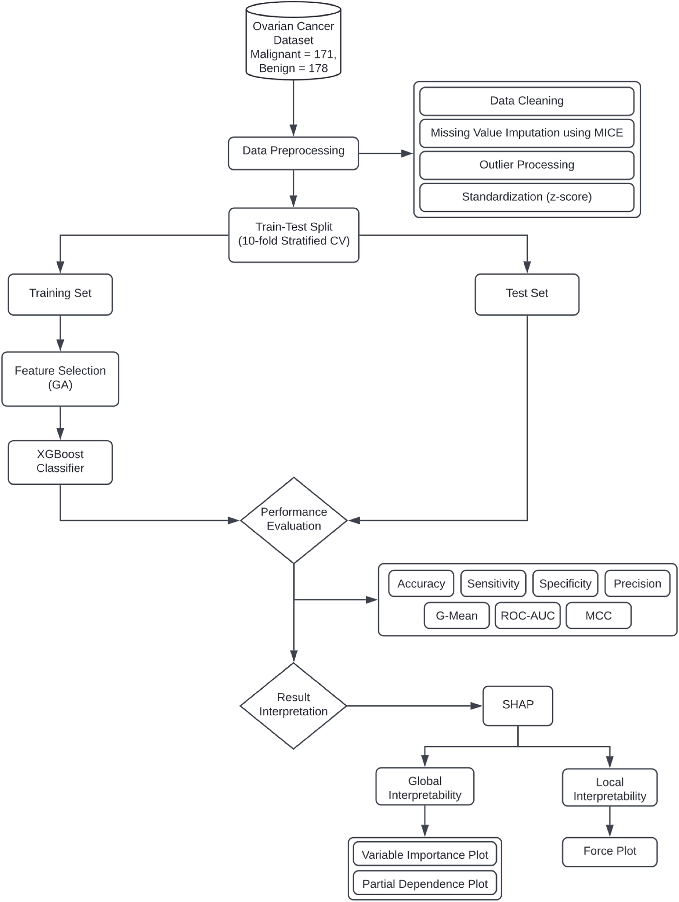

# Ovarian Cancer Detection Project

## Codes and Data

This repository contains the codes and data for the following research article.

 
 


## Project Overview

This project focuses on developing a machine learning-based diagnostic system for the reliable detection of ovarian cancer (OC), particularly in premenopausal and postmenopausal women. By leveraging explainable AI (XAI) tools like SHAP (SHapley Additive exPlanations), we aim to enhance the interpretability of model predictions, providing clinicians with valuable insights into individual risk factors.

## Workflow



The workflow of the project consists of the following key steps:

1. **Data Preprocessing**: Cleaning and preparing the data for analysis.
2. **Feature Selection**: Utilizing Genetic Algorithms to identify important features that contribute to diagnosis.
3. **Model Training**: Employing the XGBoost algorithm for training the machine learning model.
4. **Evaluation**: Assessing the model's performance using ROC-AUC scores.

## Identified Biomarkers

The project identifies several key biomarkers associated with ovarian cancer, including:

- **HE4**
- **CA125**
- **CA19-9**
- **CA72-4**
- and several more biomarkers included.

These biomarkers have shown potential in improving diagnostic accuracy over existing methods.

## References

For detailed insights, refer to the following resources:

- **Research Paper**: [An ML-based decision support system for reliable diagnosis of ovarian cancer by leveraging explainable AI
](https://doi.org/10.1016/j.imu.2024.101553)


## Getting Started

### Prerequisites

- Python 3.12.4
- Required libraries: `numpy`, `pandas`, `scikit-learn`, `xgboost`, `shap`, etc.

### Installation

Clone the repository and install the required packages:

```bash
git clone https://github.com/thanish11/ovarian_cancer_detection.git
cd ovarian_cancer_detection
pip install -r requirements.txt
